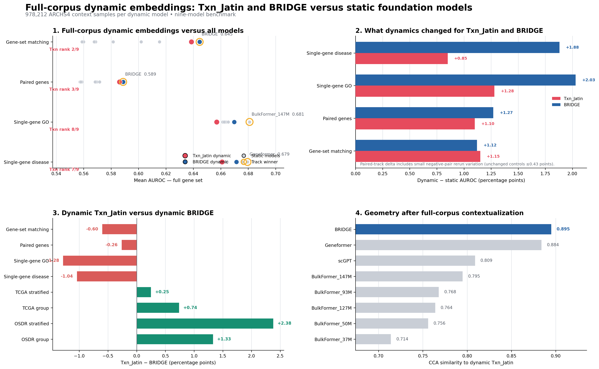

# The dynamic embedding story

## What changed

Full-corpus contextualization improved every gene-level track for both models:

- Txn_Jatin gained 0.85–1.28 AUROC points on single-gene annotation and about
  1.1 points on gene-set and paired-gene tasks.
- BRIDGE gained 1.12–2.03 AUROC points across the four tracks.
- Dynamic BRIDGE became the overall benchmark leader.
- Dynamic Txn_Jatin moved to second overall, narrowly ahead of scGPT.

## What the rankings say

Dynamic BRIDGE wins gene-set matching and the paired aggregate, ranks second
on GO, and third on disease prediction.

Dynamic Txn_Jatin remains strongest on relational tasks—second on gene-set
matching and third on paired genes. Its single-gene ranks improve from the
static run but remain its main weakness.

## What happened to the geometry

Txn_Jatin–BRIDGE CCA increased from 0.792 to 0.895. Real-expression context
pulls the two representations toward a shared biological geometry much more
strongly than the zero-input/static route.

## Practical conclusion

The dynamic experiment validates the core hypothesis: expression context
materially improves the usefulness of both BRIDGE-family gene representations.
For Txn_Jatin, the next model-training objective should preserve its strong
gene-set and sample-transfer behavior while explicitly sharpening
single-gene functional and disease structure.

